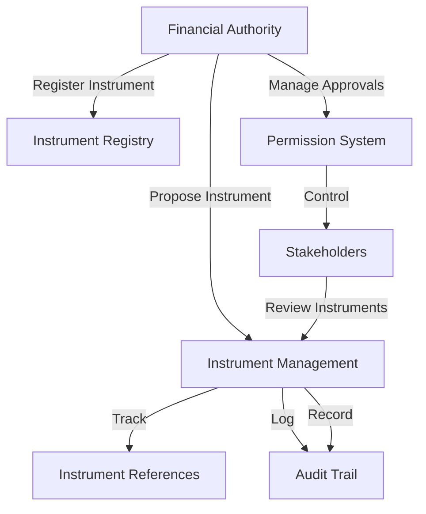

# Approve Opaque Instrument

A decentralized financial instrument approval and verification system built on the Stacks blockchain, enabling organizations to securely track, validate, and manage complex financial instruments with advanced access controls and comprehensive audit mechanisms.

## Overview

Approve Opaque Instrument provides financial institutions and investment organizations with a secure, transparent solution for managing financial instrument approvals. The system enables:

- Instrument registration on the blockchain
- Secure instrument reference tracking
- Multi-level approval workflows
- Comprehensive transaction auditing
- Version and status management

## Architecture

The system is built around a single smart contract that manages instrument registrations, approval statuses, access permissions, and comprehensive audit trails.



### Core Components

1. **Instrument Registry**: Stores instrument information and ownership
2. **Approval Management**: Tracks instrument status and validation
3. **Permission System**: Controls review and modification rights
4. **Audit System**: Tracks all instrument-related interactions

## Contract Documentation

### Permission Levels

- `PERMISSION-NONE (u0)`: No access
- `PERMISSION-REVIEW (u1)`: Basic review access
- `PERMISSION-MODIFY (u2)`: Can modify instrument details
- `PERMISSION-APPROVE (u3)`: Can approve/reject instruments
- `PERMISSION-ADMIN (u4)`: Full management rights

### Action Types

- `ACTION-CREATE (u1)`: Instrument registration
- `ACTION-REVIEW (u2)`: Instrument review
- `ACTION-MODIFY (u3)`: Instrument modification
- `ACTION-APPROVE (u4)`: Instrument approval status change
- `ACTION-INVALIDATE (u5)`: Instrument invalidation

## Getting Started

### Prerequisites

- Clarinet
- Stacks wallet
- Financial instrument compliance knowledge

### Basic Usage

1. Register an organization:
```clarity
(contract-call? .opaque_instrument register-organization "org123" "Investment Partners Inc.")
```

2. Add an instrument:
```clarity
(contract-call? .opaque_instrument register-instrument 
    "org123" 
    "instrument456" 
    "Derivative Contract" 
    "Complex financial derivative" 
    0x1234... 
    "derivative")
```

3. Grant review access:
```clarity
(contract-call? .opaque_instrument grant-instrument-permission 
    "org123" 
    "instrument456" 
    'ST1PQHQKV0RJXZFY1DGX8MNSNYVE3VGZJSRTPGZGM 
    u1)
```

## Function Reference

### Organization Management

```clarity
(register-organization (org-id (string-ascii 64)) (name (string-ascii 256)))
```
Registers a new financial organization.

### Instrument Management

```clarity
(register-instrument 
    (org-id (string-ascii 64))
    (instrument-id (string-ascii 64))
    (name (string-ascii 256))
    (description (string-utf8 500))
    (instrument-hash (buff 32))
    (instrument-type (string-ascii 64)))
```
Registers a new financial instrument.

```clarity
(update-instrument 
    (org-id (string-ascii 64))
    (instrument-id (string-ascii 64))
    (name (string-ascii 256))
    (description (string-utf8 500))
    (instrument-hash (buff 32))
    (instrument-type (string-ascii 64)))
```
Updates an existing instrument's details.

### Access Control

```clarity
(grant-instrument-permission 
    (org-id (string-ascii 64))
    (instrument-id (string-ascii 64))
    (user principal)
    (permission-level uint))
```
Grants review/modification permissions.

```clarity
(revoke-instrument-permission 
    (org-id (string-ascii 64))
    (instrument-id (string-ascii 64))
    (user principal))
```
Revokes access permissions.

## Development

### Testing

1. Clone the repository
2. Install dependencies
3. Run tests:
```bash
clarinet test
```

### Local Development

1. Start Clarinet console:
```bash
clarinet console
```

2. Deploy contract:
```bash
clarinet deploy
```

## Security Considerations

### Access Control
- Only organization administrators can register instruments
- Strict permission levels with granular access
- Comprehensive logging of all interactions
- Immutable audit trails

### Data Privacy
- Only instrument references stored on-chain
- Actual instrument documents stored securely off-chain
- Multi-level approval workflows
- Cryptographic verification of instrument references

### Limitations
- Instrument hashes must be managed securely
- Approval processes require specific permission levels
- No on-chain instrument content storage
- Limited to 64-character organization and instrument IDs